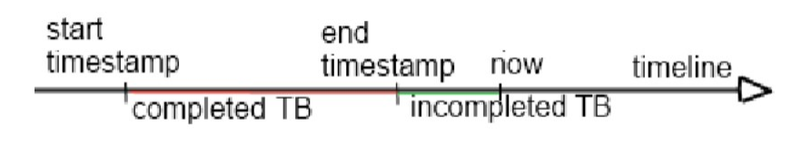

# Trend bar service

## Terminology

 ### Symbol

[Link to class](./src/main/java/com/spotware/trendbar/model/Symbol.java)

A currency pair (e.g., EURUSD, EURJPY).

### Quote
[Link to class](src/main/java/com/spotware/trendbar/model/Quote.java)

A price update for a particular symbol that occurs at a specific moment in time.  
It contains the new price, the symbol, and the timestamp.

### Trend bar (TB)

[Link to class](src/main/java/com/spotware/trendbar/model/TrendBar.java)

Also known as a candlestick—aggregated quote data for a particular symbol within a given trend bar period.  
More details about trend bars (candlesticks) can be found [here](https://help.ctrader.com/knowledge-base/chart-types/). 

Note that it doesn’t contain all the information about the quotes on which it is based.  
It contains only the following parameters:

 * *open price* – the price for a given symbol at the beginning of the trend bar period
 * *close price* – the price from the last received quote in this trend bar period
 * *high price* – the maximum price during the period
 * *low price* – the minimum price during the period
 * *trendbar period* - a certain time interval during which quotes are accumulated (e.g., M1 for one minute,  
   H1 for one hour, D1 for one day, etc.)
 * *timestamp* – the moment in time at which the trend bar period starts

A trend bar always starts at the beginning of its time period.  
If it’s a minutely trend bar, they start at 00:00:00, 00:01:00, and so on.  
If it’s an hourly trend bar, they start at 00:00:00, 01:00:00, and so on.

Note that the quote time and server time may differ, but the TB is based on the quotes’ timestamps.

### Completed TB

A TB whose time interval has ended. For example, if we’re considering an M1 TB, then the completed TBs are those that have been created on or before the beginning of the previous minute.

### TB history

A set of completed TBs whose start times fall within a specific period.

## Task description

Let’s assume that there are three types of trend bars: M1 (minutely), H1 (hourly), and D1 (daily).  
We need to implement a trend bar service that:

1. Builds TBs based on received quotes. This means the service should maintain a set of current TBs, update them on each quote, and persist them to some 
   storage as soon as the period for a trend bar is over.
2. Provides a trend bar history upon request. Specifically, it should return a set of TBs by a given symbol name, trend bar period, and *from* timestamp and *to* timestamp. If the *to* timestamp is omitted, the method should return all TBs between the *from* timestamp and the current time.

To verify the solution's operability, it is necessary to implement an integration test that simulates a high-load system scenario.

## General requirements

1. The source code must be compilable. If it is not, then the task is not considered complete.
2. The source code must be covered by tests. You may use JUnit or TestNG as the test framework.
3. It’s very important to make the source code as clean (in terms of the *Clean Code* book by Uncle Bob) and easy to understand as possible. Don’t waste time on Javadoc; good code should document itself.
4. The code should be formatted according to the standard [Java Code Style](https://www.oracle.com/java/technologies/javase/codeconventions-contents.html).
5. The TB service should process received quotes asynchronously — that is, it should not process a received quote in the same thread, but instead put it into 
   some kind of internal storage for further processing by another thread. It would be nice to have trivial implementations of a quotes provider to use in integration tests.

## Limitations and clarifications

1. **Keep it simple.**
2. **Do not use the Spring framework for anything other than dependency injection.**  
   DI is a very useful approach, so don’t hesitate to use it where it’s applicable. Otherwise, we would like to see your code, not “Spring magic.”
3. **Use Test Driven Development to implement this task.**  
   This will help you write clean and concise code.
4. **Use the provided classes and interfaces.**  
   They are meant to save time (yours and ours). If you want, you can extend them.

TB history includes only completed TBs.

TB storage can be in-memory (not an in-memory database, but some data structure in the Java heap).  
Remember that quotes arrive on one thread, and the history may be requested on another.

Quotes arrive in natural order — that is, the timestamp of the next quote is always greater than the timestamp of the previous one.

The number of quotes received per minute can be very large.

A trend bar should be updated as soon as possible when a quote is received.

Time zones do not matter in this task. It is acceptable to use just Unix time in milliseconds.

Keep in mind that the trend bar service is a module of a system, not a standalone application, so there is no need to expose this service via web services or implement a UI for it.